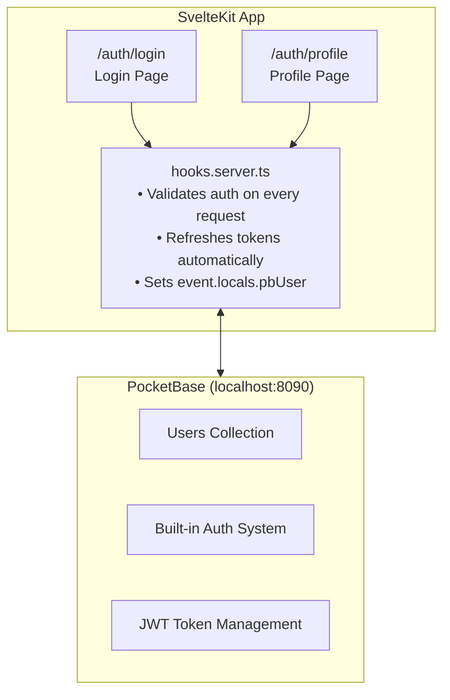
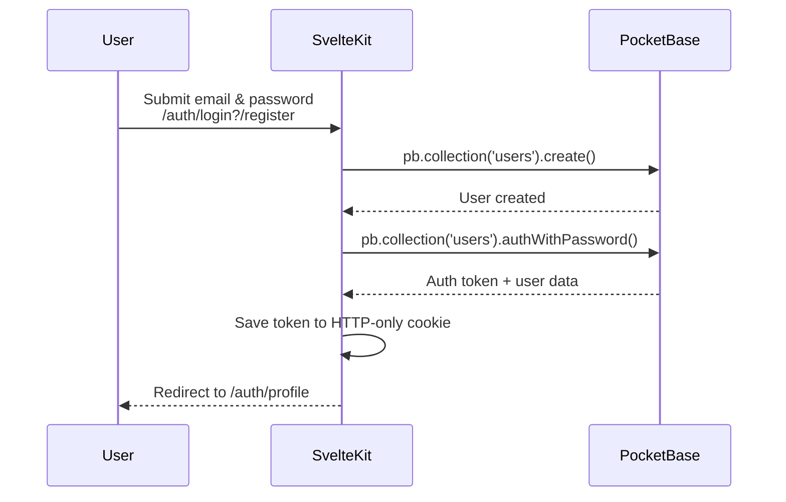
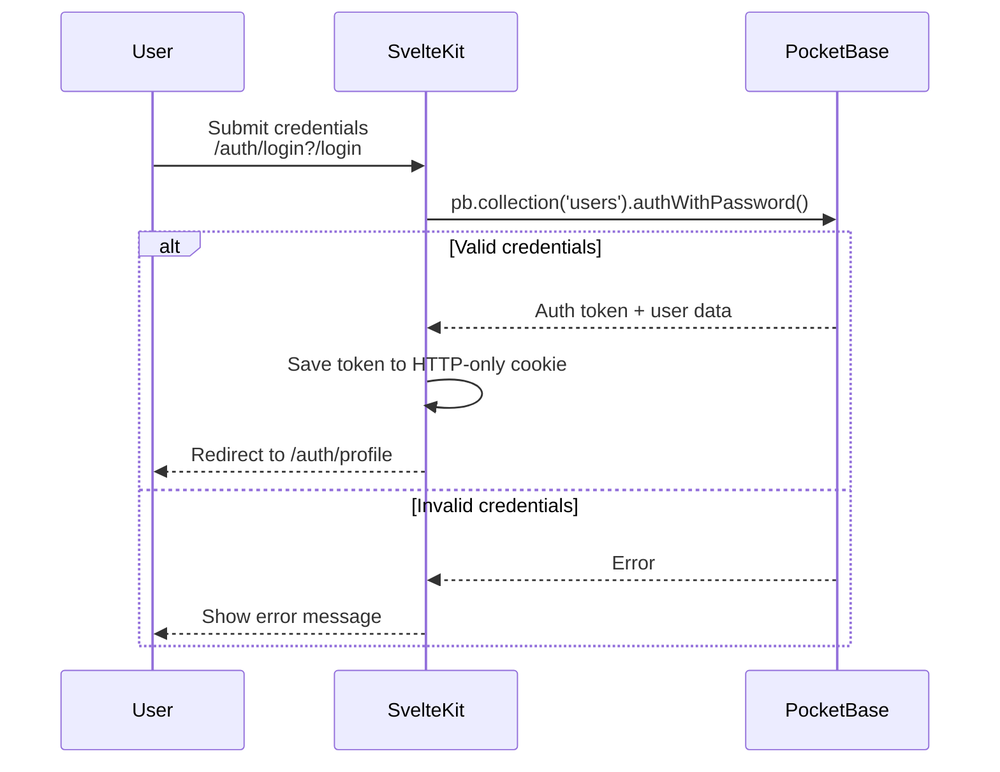
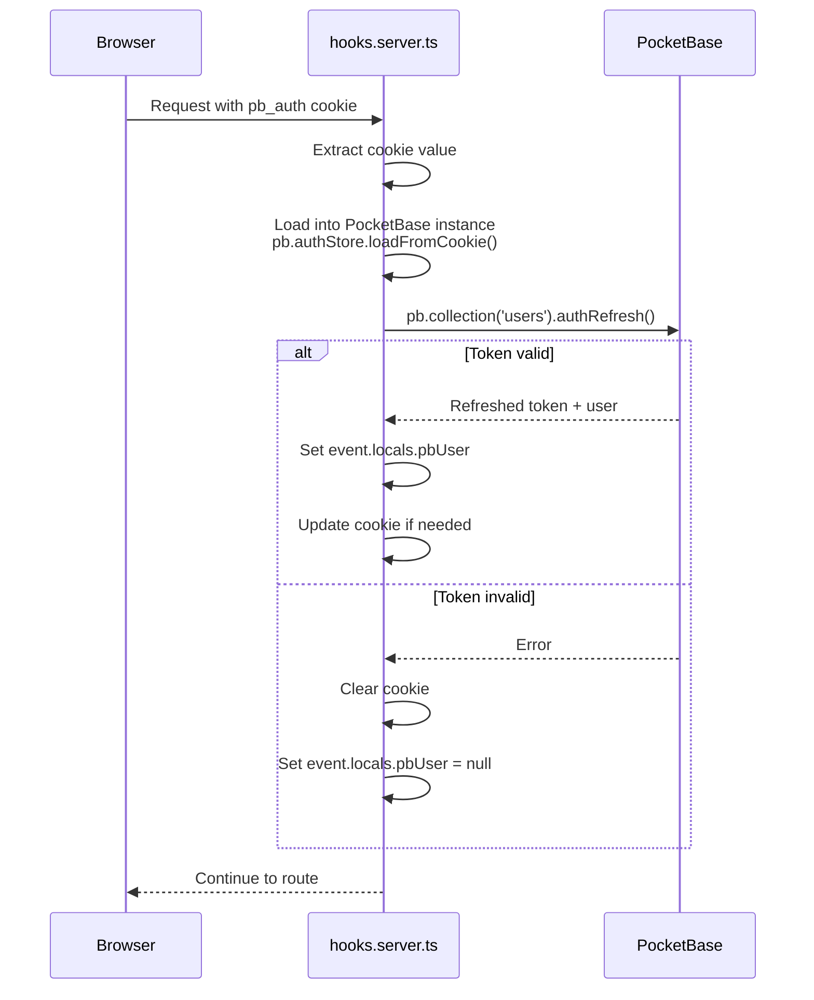
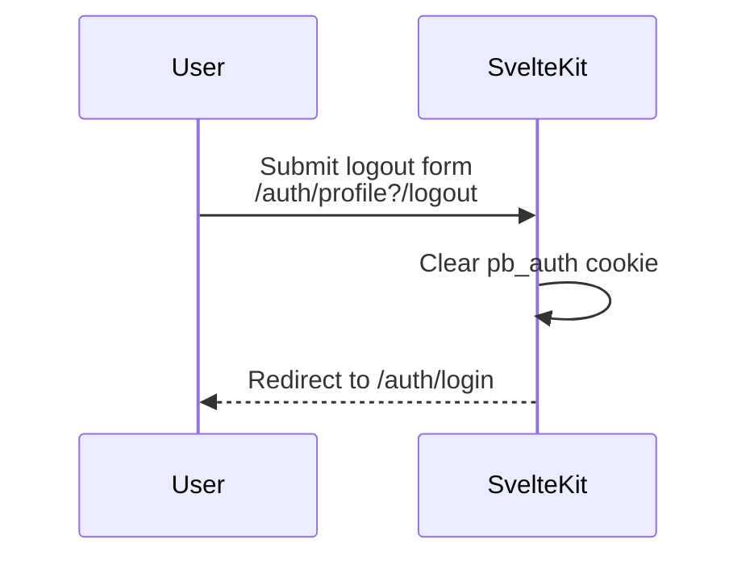

# Authentication with SvelteKit and PocketBase

This document explains how authentication is set up to work between the SvelteKit frontend (`/app`) and the PocketBase backend (`/server`).

## Overview

The authentication system uses PocketBase's built-in auth system with the JavaScript SDK. Authentication state is managed server-side using cookies, with the auth token stored in an HTTP-only cookie for security.

## Architecture



## Key Files

### Client-Side

**`src/lib/pocketbase.ts`**
- Creates the PocketBase client instance
- Exports a Svelte store (`currentUser`) for reactive auth state
- Connects to PocketBase at `http://127.0.0.1:8090`

### Server-Side

**`src/lib/server/pocketbase.ts`**
- Server-side PocketBase utilities
- Cookie management for auth state
- Key functions:
  - `createServerPb()` - Creates a new PocketBase instance
  - `createServerPbWithAuth(event)` - Creates instance with auth loaded from cookies
  - `savePbAuthCookie(event, pb)` - Saves auth state to cookie
  - `clearPbAuthCookie(event)` - Clears the auth cookie
  - `validatePbAuth(pb)` - Validates and refreshes the auth token

**`src/hooks.server.ts`**
- Contains `handlePbAuth` middleware
- Runs on every request
- Validates the auth token
- Populates `event.locals.pbUser` with the current user

**`src/app.d.ts`**
- TypeScript declarations for `App.Locals`
- Defines the `pbUser` type on locals

### Routes

**`/auth/login`**
- Login and registration form
- Form actions for `login` and `register`
- Redirects to `/auth/profile` on success

**`/auth/profile`**
- Protected route (redirects to login if not authenticated)
- Displays user information
- Logout functionality

## Authentication Flow

### Registration



### Login



### Session Validation (Every Request)



### Logout



## Cookie Configuration

The auth cookie (`pb_auth`) is configured with:
- `httpOnly: true` - Prevents XSS attacks
- `secure: true` (production only) - HTTPS only
- `sameSite: 'lax'` - CSRF protection
- `path: '/'` - Available site-wide
- `maxAge: 7 days` - Auto-expiry

### Cookie Format Handling

PocketBase's SDK has specific requirements for cookie handling:

**Saving cookies**: `pb.authStore.exportToCookie()` returns a full Set-Cookie header string like `pb_auth=<encoded_value>; Path=/; ...`. We extract just the value part for SvelteKit's `cookies.set()`:

```typescript
export function savePbAuthCookie(event: RequestEvent, pb: PocketBase) {
  const exportedCookie = pb.authStore.exportToCookie();
  const match = exportedCookie.match(/^pb_auth=([^;]+)/);

  if (match && match[1]) {
    event.cookies.set(pbCookieName, match[1], {
      httpOnly: true,
      secure: process.env.NODE_ENV === 'production',
      sameSite: 'lax',
      path: '/',
      maxAge: 60 * 60 * 24 * 7 // 7 days
    });
  }
}
```

**Loading cookies**: `pb.authStore.loadFromCookie()` expects the format `pb_auth=<value>`, so we reconstruct this when loading:

```typescript
export function createServerPbWithAuth(event: RequestEvent) {
  const pb = createServerPb();
  const cookie = event.cookies.get(pbCookieName);

  if (cookie) {
    // loadFromCookie expects the format: "pb_auth=<value>"
    pb.authStore.loadFromCookie(`${pbCookieName}=${cookie}`);
  }

  return pb;
}

## Protecting Routes

### Server-Side (Recommended)

In `+page.server.ts`:

```typescript
import { redirect } from '@sveltejs/kit';
import type { PageServerLoad } from './$types';

export const load: PageServerLoad = async ({ locals }) => {
  if (!locals.pbUser) {
    redirect(302, '/auth/login');
  }

  return {
    user: locals.pbUser
  };
};
```

### Using Layout Load

For protecting multiple routes, use a layout:

```typescript
// src/routes/protected/+layout.server.ts
import { redirect } from '@sveltejs/kit';
import type { LayoutServerLoad } from './$types';

export const load: LayoutServerLoad = async ({ locals }) => {
  if (!locals.pbUser) {
    redirect(302, '/auth/login');
  }
};
```

## PocketBase Setup

Ensure PocketBase is running with the default `users` collection enabled:

```bash
cd server
./pocketbase serve
```

PocketBase will be available at:
- API: `http://127.0.0.1:8090/api/`
- Admin UI: `http://127.0.0.1:8090/_/`

## Environment Variables

For production, configure the PocketBase URL:

```env
# .env
PUBLIC_POCKETBASE_URL=https://your-pocketbase-instance.com
```

Then update `src/lib/pocketbase.ts` and `src/lib/server/pocketbase.ts` to use:

```typescript
import { PUBLIC_POCKETBASE_URL } from '$env/static/public';

const pb = new PocketBase(PUBLIC_POCKETBASE_URL);
```

## Security Considerations

1. **HTTP-Only Cookies**: Auth tokens are stored in HTTP-only cookies, preventing JavaScript access and XSS attacks.

2. **Server-Side Validation**: All auth validation happens server-side in hooks, not client-side.

3. **Token Refresh**: Tokens are automatically refreshed on each request to maintain session validity.

4. **Secure Cookies**: In production, cookies are marked as secure (HTTPS only).

5. **SameSite**: Cookies use `sameSite: 'lax'` for CSRF protection.

## Extending Authentication

### Adding OAuth Providers

PocketBase supports OAuth out of the box. Configure providers in the PocketBase admin UI, then use:

```typescript
const authMethods = await pb.collection('users').listAuthMethods();

// OAuth login
await pb.collection('users').authWithOAuth2({ provider: 'google' });
```

### Email Verification

Enable email verification in PocketBase admin, then:

```typescript
// Request verification email
await pb.collection('users').requestVerification(email);
```

### Password Reset

```typescript
// Request password reset
await pb.collection('users').requestPasswordReset(email);
```
